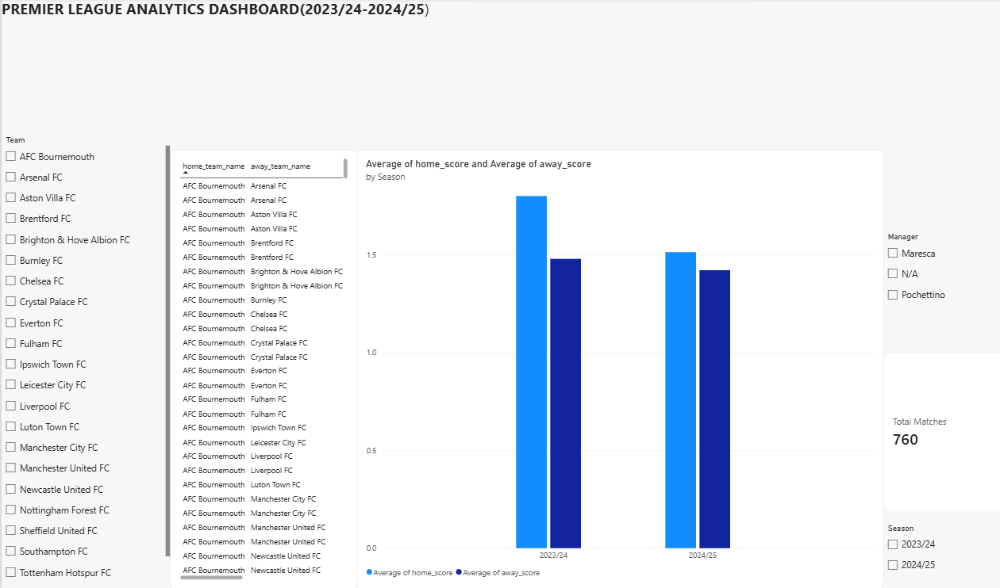

# Premier League Analytics Pipeline & Dashboard

An automated Python pipeline that pulls Premier League match data from a public football API into a PostgreSQL database, covering the 2023/24 and 2024/25 seasons.

## Tech Stack
- Python (requests, psycopg2)
- PostgreSQL
- SQL (joins, CTEs, window functions)
- Power BI

## Features
- Automated data pipeline from football data.org API into PostgreSQL
- SQL analysis: rolling team form, head-to-head records, manager-era performance splits (Pochettino vs. Maresca)
- Interactive Power BI dashboard filterable by team, season, and manager


## Dashboard Preview




## Setup & Usage

**Requirements:**
- Python 3.x
- PostgreSQL
- A free API key from [football-data.org](https://www.football-data.org/)

**1. Install dependencies**
```bash
pip install -r requirements.txt
```

**2. Set up the database**
```bash
createdb pl_analytics
psql pl_analytics -f schema.sql
```

**3. Set your API token as an environment variable**
```bash
export FOOTBALL_API_TOKEN="your_token_here"
```

**4. Run the pipeline**
```bash
python3 fetch_matches.py
```

**5. Run the analysis queries**
```bash
psql pl_analytics -f queries.sql
```